# Online Chess Game

A 2-player chess game that runs entirely in the browser, with no backend:
the board, rules, and interface are all built in plain, object-oriented
JavaScript, wrapped in a royal theme (gold, bronze, Cinzel).

## Features

- 8x8 board generated dynamically in JavaScript
- Object-oriented piece classes (`Piece` as the base class, extended by
  `Pawn`, `Rook`, `Knight`, `Bishop`, `Queen`, `King`)

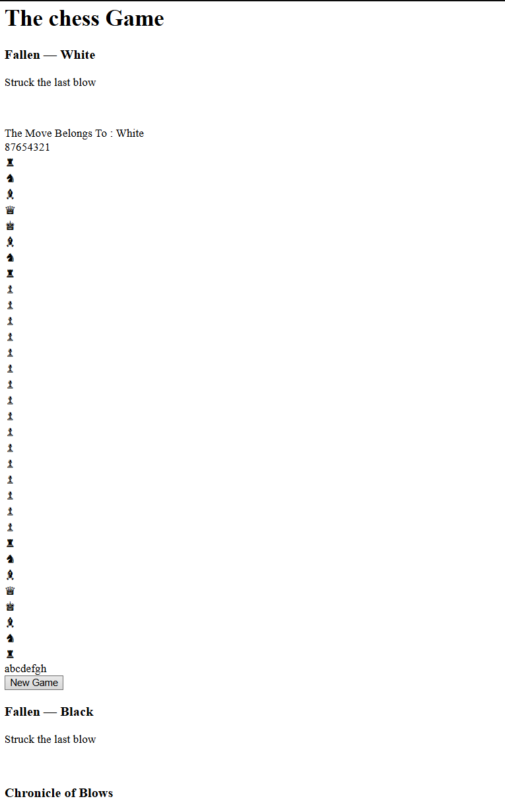

- Full per-piece movement rules, including pawn promotion — the player
  chooses Queen, Rook, Bishop, or Knight via an on-screen picker (see
  [Promotion](#promotion) below)
- Castling (kingside and queenside), with all standard safety checks (see
  [Castling](#castling) below)
- Check, checkmate, and stalemate (draw) detection
- A player can never make a move that would leave their own king in check
- Turn switching (White / Black)


- Move history panel

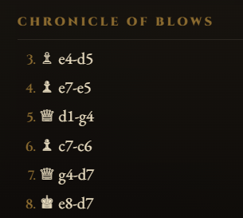

- Captured pieces displayed on dedicated trays

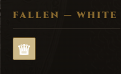

- Piece selection with legal-move and capture highlighting

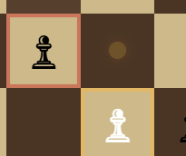

- Drag & drop (HTML5 Drag & Drop API), in addition to click-to-move
- Board coordinates (a-h / 8-1) shown along the edges
- "New Game" button to restart

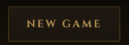

- Custom visual theme (gold/bronze palette, Cinzel typeface, ornate frame)


## Castling

Both kingside (`O-O`) and queenside (`O-O-O`) castling are implemented, with
the full standard rule set:

- Neither the king nor the chosen rook has moved yet
- No pieces stand between the king and the rook
- The king is not currently in check
- The king does not pass through, or land on, a square attacked by the
  opponent

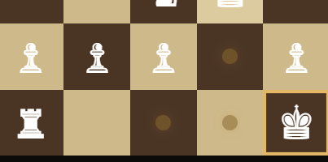
*Before castling — king and rook still in their starting position.*

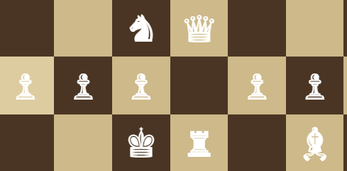
*After castling — the king has moved two squares and the rook has jumped to
the other side of it.*

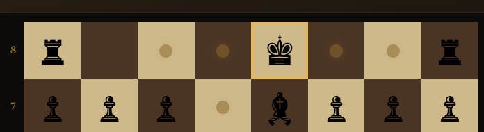
*Castling on the other side (kingside vs. queenside).*

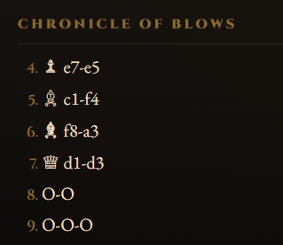
*Detail: the move is only offered when it's actually legal (king and rook
haven't moved, path is clear, king isn't in or passing through check).*

## Promotion

When a pawn reaches the last rank an on-screen picker opens and the game waits for the player to choose which piece it becomes: Queen, Rook, Bishop, or Knight. The board doesn't update until a choice is made, and the move history records the exact promotion, not just a default queen.

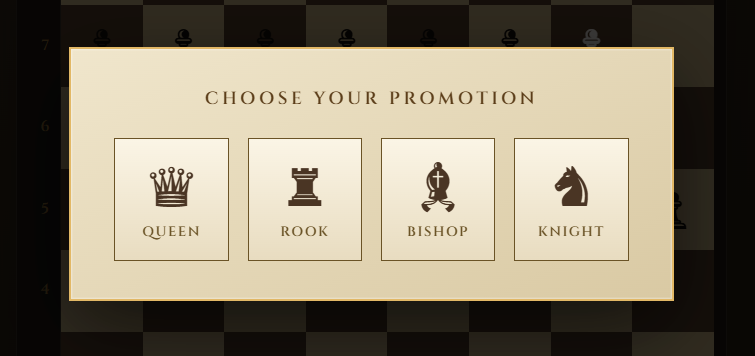

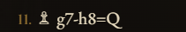

## Visual customization

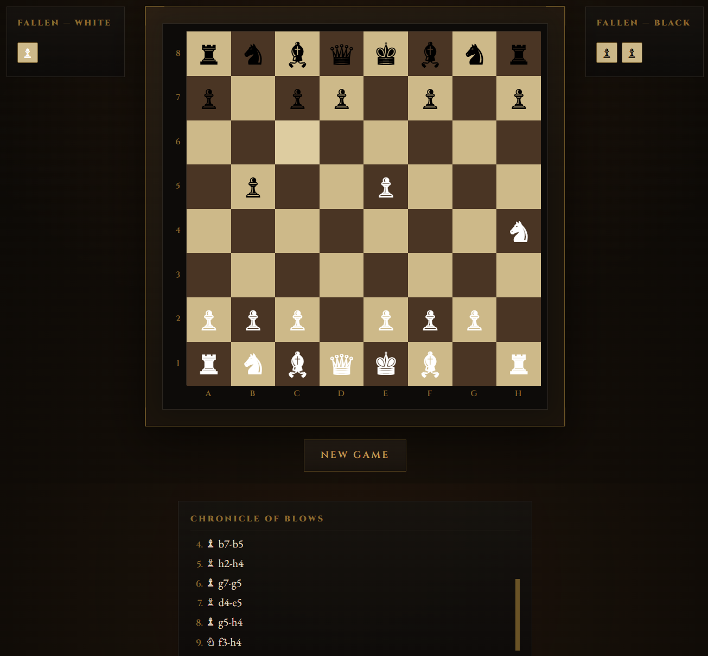

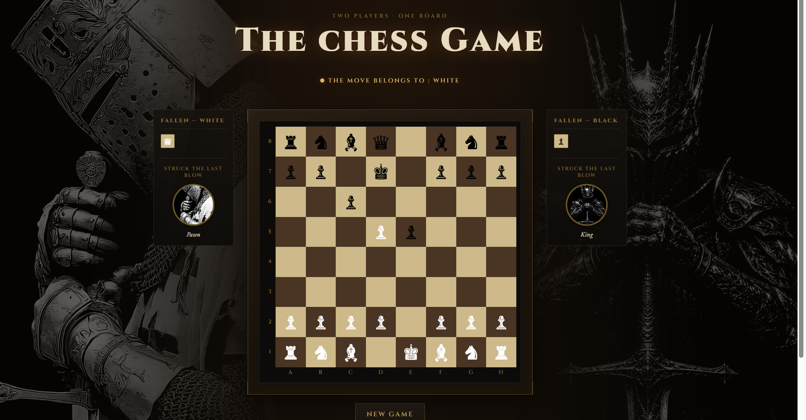

Below each "Fallen" tray, a medallion shows the piece that struck the last
blow for that side, and a large themed image can fill the empty margins on
each side of the screen.

By default both use a built-in vector glyph. To use your own artwork
instead, drop PNG files into `IMAGE/Pieces/` following this exact naming
convention:

```
white-pawn.png    black-pawn.png
white-knight.png  black-knight.png
white-bishop.png  black-bishop.png
white-rook.png    black-rook.png
white-queen.png   black-queen.png
white-king.png    black-king.png
```

If a file is missing, the game falls back to the vector glyph automatically
nothing breaks.

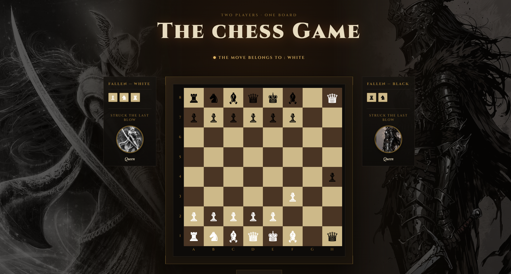

## Project structure

```
.
├── index.html    Page structure (board, panels, move history)
├── style.css     Visual theme (colors, typography, layout)
├── pieces.js     Piece classes and their movement rules (OOP)
├── board.js      Board class: 8x8 grid, moving pieces, attack detection
├── game.js       Game class: turns, legal moves, check/mate, history
├── main.js       DOM rendering and interaction handling (click & drag)
└── IMAGE/
    ├── *.png                      Screenshots used throughout this README
    └── Pieces/                    Optional custom piece portraits (see above)
```

## Getting started

No installation or server required.

1. Download or clone this repository.
2. Keep all files at the same level (no subfolders), except `IMAGE/`.
3. Open `index.html` in your browser (double-click works fine).

## How to play

1. White moves first. Click one of your pieces to select it (or start
   dragging it directly): the squares it can legally move to light up.
2. Click a highlighted square to move the piece there, or drop it directly
   on that square if you're dragging it (or on an outlined enemy piece to
   capture it).
3. The turn automatically passes to the other player.
4. If a king is in check, it's highlighted in red and a message is shown.
5. The game ends on checkmate or stalemate; a message announces the result.
6. Click **New Game** at any time to restart.

## Tech stack

- HTML5 / CSS3
- JavaScript (ES6, classes, no external dependencies)
- [Cinzel](https://fonts.google.com/specimen/Cinzel) and
  [EB Garamond](https://fonts.google.com/specimen/EB+Garamond) fonts via
  Google Fonts

---

# Online chess game

## Description
This project consists of building an online chess game using HTML, CSS, and JavaScript. The goal is to create an interactive 2-player chess game that works in the browser, using only local technologies — no servers are required. Players should be able to move pieces according to chess rules, restart games, and track whose turn it is.

The chess board will be generated dynamically with JavaScript, and all the logic — including legal move detection, check/checkmate logic, turn switching, and move history — must be implemented in JavaScript. The game runs completely in the browser and does not require any backend.

## Getting Started
1. Clone this repository or download the files.
2. Install required packages if necessary.

Keep in mind that the code must be written in OOP.

## Tasks
- Set up the HTML/CSS structure for an 8x8 chess board.
- Dynamically generate the board using JavaScript.
- Define chess piece classes (e.g. King, Queen, Rook, etc.).
- Implement logic for:
	Valid moves per piece
	Turn switching
	Check and checkmate detection
	Illegal move prevention
- Allow restart/reset of the game.
- Show captured pieces.
- Implement a move history panel.
- Display which player's turn it is.
- Style the board and pieces using CSS or image assets.
- Highlight legal moves when a piece is selected.
- Allow dragging and dropping pieces (drag & drop API).
- Final testing. Create README with instructions and screenshots. Submit as Git repo.

## Estimated time to work 2 weeks