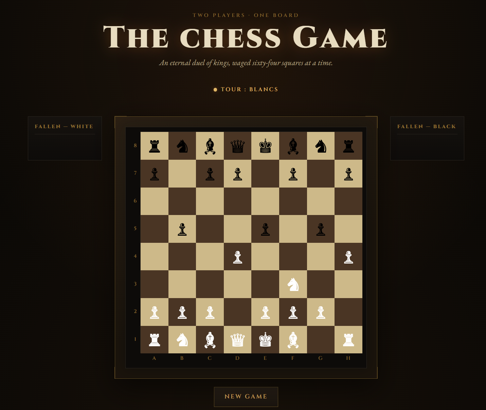

# The Royal Game — Online Chess Game

A 2-player chess game that runs entirely in the browser, with no backend:
the board, rules, and interface are all built in plain, object-oriented
JavaScript, wrapped in a "royal candlelit salon" theme (gold, bronze, Cinzel).

## Preview



## Features

- 8x8 board generated dynamically in JavaScript
- Object-oriented piece classes (`Piece` as the base class, extended by
  `Pawn`, `Rook`, `Knight`, `Bishop`, `Queen`, `King`)
- Full per-piece movement rules (including pawn promotion to Queen)
- Check, checkmate, and stalemate (draw) detection
- A player can never make a move that would leave their own king in check
- Turn switching (White / Black)
- Move history panel
- Captured pieces displayed on dedicated trays
- Piece selection with legal-move and capture highlighting
- Drag & drop (HTML5 Drag & Drop API), in addition to click-to-move
- Board coordinates (a-h / 8-1) shown along the edges
- "New Game" button to restart
- Custom visual theme (gold/bronze palette, Cinzel typeface, ornate frame)
- Responsive layout (adapts to mobile screens)

## Known limitations / future improvements

- Castling is not implemented
- En passant is not implemented
- No choice of promotion piece (always promotes to Queen)
- No game save between sessions

## Project structure

```
.
├── index.html    Page structure (board, panels, move history)
├── style.css     Visual theme (colors, typography, layout)
├── pieces.js     Piece classes and their movement rules (OOP)
├── board.js      Board class: 8x8 grid, moving pieces, attack detection
├── game.js       Game class: turns, legal moves, check/mate, history
└── main.js       DOM rendering and interaction handling (click & drag)
```

## Getting started

No installation or server required.

1. Download or clone this repository.
2. Keep all files at the same level (no subfolders).
3. Open `index.html` in your browser (double-click works fine).

Optional — run a small local server (handy if you later want to add images
or network calls):

```bash
python3 -m http.server 8000
```

then open `http://localhost:8000`.

## How to play

1. White moves first. Click one of your pieces to select it (or start
   dragging it directly): the squares it can legally move to light up.
2. Click a highlighted square to move the piece there, or drop it directly
   on that square if you're dragging it (or on an outlined enemy piece to
   capture it).
3. The turn automatically passes to the other player.
4. If a king is in check, it's highlighted in red and a message is shown.
5. The game ends on checkmate or stalemate; a message announces the result.
6. Click **New Game** at any time to restart.

## Tech stack

- HTML5 / CSS3
- JavaScript (ES6, classes, no external dependencies)
- [Cinzel](https://fonts.google.com/specimen/Cinzel) and
  [EB Garamond](https://fonts.google.com/specimen/EB+Garamond) fonts via
  Google Fonts